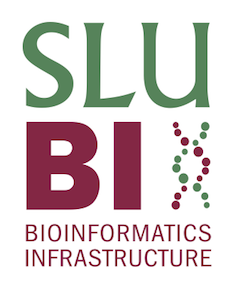

This advanced module of P000187, Reproducible Research in Bioinformatics and Computational Biology, is hosted by the [Swedish Agricultural University's Bioinformatics Infrastructure (SLUBI)](www.slubi.se). 

In this module we hope to advance your knowledge on how to use reproducible bioinformatics pipelines, report results in a streamlined manner, and implement the system in your own research.

Feedback is appreciated!

(This is a Quarto website. To learn more about Quarto websites visit <https://quarto.org/docs/websites>.)

