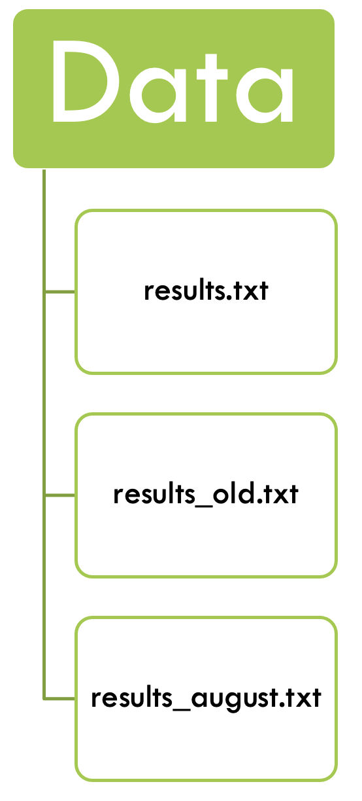
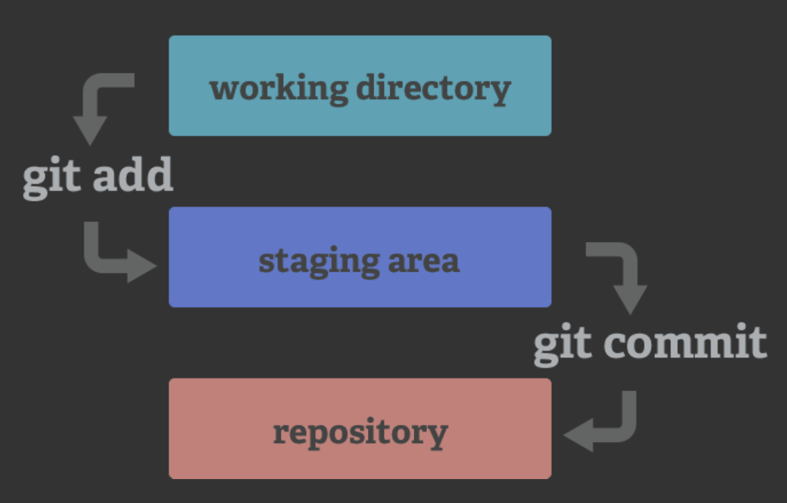
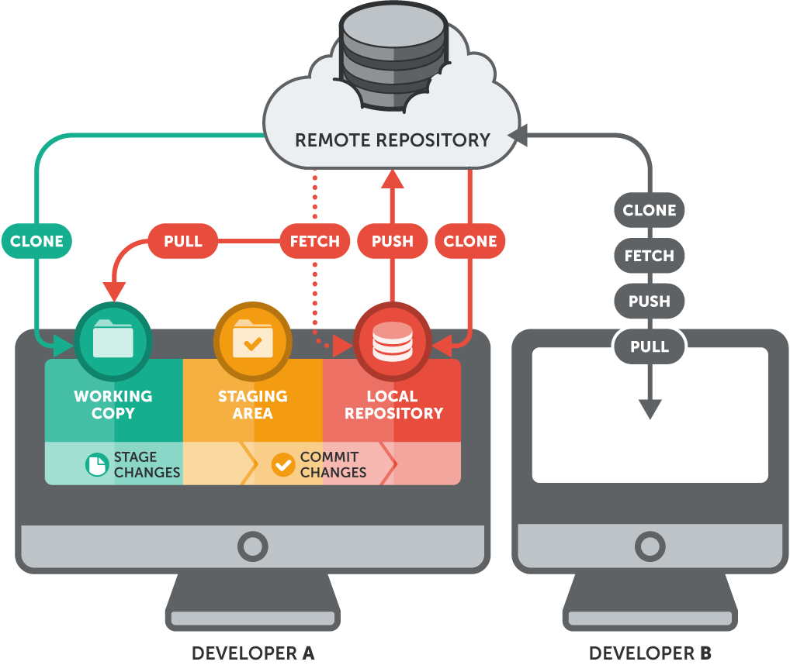

We all have worked on data before, done analyses, talked with our PI, changed the analyses, worked a bit more... and in the end we have something like this: 

{.class width=20%}

**Version control**, the practice of tracking and managing changes to files, can help us not descend into chaos. With a version controlled project you always know which file, and even which part of the file, is the most recent, and you can even go back to older versions if you have to. 

Version control can be used on the local system, where both the version database and the checked out file - the one that is actively being worked on - are on the local computer. Good, but the local computer can be corrupted and then the data is compromised.

](figures/git/Local_version_control_diagram.png){.class width=50%}

Version control can also be centralized, where the version database is on a central server, and the active file can be checked out from several different computers. This is useful when working from different systems, or when working with collaborators. However, when the central servers is compromised the historical version are lost. 

](figures/git/Centralized_version_control.png){.class width=50%}

At last, version control can be fully distributed, with all versions of the file being on the server and different computers. Each computer checks out the file from its own version database to work on them. The databases are then synchronized between the different computers and the server. One such distributed version control system is `git`. It can handle everything from small to very large projects and is simple to use. `GitHub`is a code hosting platform for version control and collaboration, built on git.

](figures/git/git_distributed_version_control.png){.class width=50%}

Distributed version control **facilitates collaboration** with others. Software like `git` automatically tracks differences in files, and flags conflicts between files. 

Additionally, GitHub, the code hosting platform based on git that we are using in this course, can be used to **maintain uniformity** within a working group. The group can develop their own project template that people can use and populate for their own projects.

## git

**Git** is a **version control software** that is fully distributed - meaning that each project folder contains the full history of the project. These folders are also called `repositories` and can be on several computers, or servers. 

::: {.callout-note}
A **repository in git** is the .git/ folder inside of your directory. This repository tracks all changes made to files in your project and contains your project history. Usually we refer to the git repository as the **local repository**. 
:::

Let's have a closer look at how it works:

>Git has three main states that your files can reside in: modified, staged, and committed:

>- Modified means that you have changed the file but have not committed it to your database yet.
- Staged means that you have marked a modified file in its current version to go into your next commit snapshot.
- Committed means that the data is safely stored in your local database.

> [source: git documentation](https://git-scm.com/book/en/v2/Getting-Started-What-is-Git%3F)

This leads to the three main sections of a Git project: the working directory, the staging area, and the Git directory (or repository).

](figures/git/git_diagram.png){.class width=70%}

And the basic commands of git: 

{.class width=50%}

The majority of your version control work will happen in your local repository. You have the entire history of the project on your local disk, and do not need an internet connection to work on your data with git. 

However, if you want to **have a backup** of your code, **share it** or **collaborate with others**, you might want to add GitHub into the mix:

# GitHub

 
**Github** is a **code hosting platform** that is **based on git**. Here you can store, track and publish code (and code only, do NOT use github for data!). On Github you can collaborate with colleagues and work on projects together. 

 

::: {.callout-note}
A **repository in GitHub** is where you can store your code, your files, together with their revision history. Repositories can be public or private, and might have several collaborators. Usually we refer to the Github repository as the **remote repository**. 
:::

## Working with GitHub

If you have a repository on GitHub you can **clone** its contents to you local server. That clones both the working copy, and the .git repository. 

You can then work locally on your project, make changes, stage and commit them. Then, you can **push** them to the remote repository on GitHub, syncing the local and the remote repository. From there your collaborator can then **pull** them again. 

{fig-align="center" width=75%}

## Collaborating on GitHub

With the setting above you can share code with someone, and this works well when publishing code. This works well when you own the GitHub repository or have write access to it.

In collaborative and open-source settings, however, you often want to contribute to a repository you do not control. This is where **forking** comes in.

Forking a repository means creating your own copy of an existing GitHub repository under your own GitHub account. Your fork is a remote repository that you control, but it still remembers where it came from.

You then clone your fork to your local computer and work as usual: add, commit, push, and pull. When you are ready to share your changes, you can propose them back to the original repository by opening a **pull request**: a request to merge your changes into the original project.

In this way, forking allows collaboration without giving everyone direct write access to the same repository. It also allows for more formal collaboration, with quality checked code etc. 

{fig-align="center"}