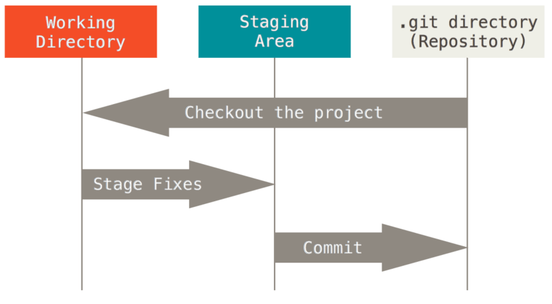
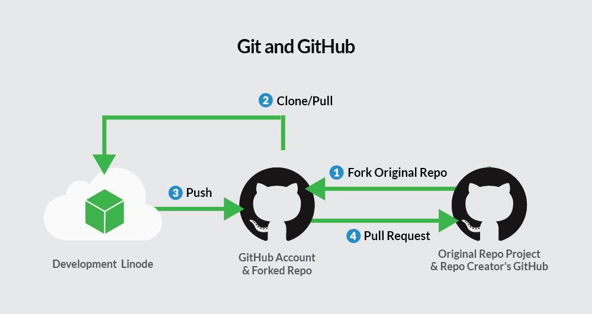

Now we have changed files and committed those changes on Github, and now we would like to add the files you have already worked on to them. 

Then, your can work on our code locally on our computer (just as you are used to) and to use git/Github to track our work in the future.

We will follow the Data carpentries tutorial [here](https://datacarpentry.org/rr-version-control/03-git-in-rstudio/).

# Basic git workflow

Remember the basic git workflow?

# In this tutorial 

We already created our git repository on Github. 

Now we will:

- clone the contents of the remote repository to our local computer
- change, stage and commit
- push changes to the remote repository

So, let's try this out!

# Clone the repository to RStudio

Now you have a repository in your github account, but you want to work locally on your computer. You need to clone the repository to your local environment.

- On GitHub, click on the green `Code` button on the repository page.
- On the `local` tab select `ssh`.
- Click the `Copy to clipboard` icon to the right of the repository URL (looks like two slightly overlapping pages).
- Open RStudio on your computer.
- Click `File` &rarr;  `New Project` &rarr; `Version Control` &rarr; `Git`.
- **Paste the repository URL** into the appropriate field and **browse to the desired directory** for your R project. 
- Click `Create Project`.

::: {.callout-tip}
Leave the directory name field empty, the project will then have the same name as your GitHub directory. 
:::

Now you have the contents of your repository locally in RStudio. This means:

- the files are on your computer,
- Git is tracking changes, and
- the repository is still linked to the remote version on GitHub.

From this point on, you can work with your files as usual, but RStudio also provides built-in tools to interact with Git directly from the interface.

## The Git tab in RStudio

When a project is connected to a Git repository, RStudio automatically adds a new **Git tab** to the interface. It is located in the top-right pane of RStudio.

The Git tab allows you to:

- see which files are tracked by Git,
- check whether files have changed,
- view the commit history,
- commit and push changes later on.

For now, we will focus on exploring the existing history.

## Viewing the commit history

1. Click on the Git tab.
2. Click the button that looks like a clock.

A window will open showing the commit history of the repository. Each entry represents one saved change and includes:

- a short description of the change (the commit message),
- the author,
- the date and time.

If you click on a commit, you can see which files were changed and how.

::: {.callout-important}
The commit history you see here is the same history you saw earlier on GitHub, the local project in RStudio and the remote repository on GitHub are connected.
:::

## Working with Git in RStudio

From this point on, your typical workflow will be:

- make changes locally,
- commit them in RStudio,
- push them to GitHub.

We will practice these steps next.

# Add files to the repository

There are several ways to add files to a Git repository. Below are two common options.

## Add files via RStudio

1. In RStudio, go to the `Files` tab (lower right pane).
2. Click `Blank File`.
3. Choose the type of document you want to create (for example, R Script or Quarto).
4. Give the file a meaningful name and create it by clicking OK.

The new file will now appear in your project and can be tracked by Git.

## Add files via copy and paste

If you already have files you want to include:

1. Copy the file(s) into your RStudio project directory.
2. Switch back to RStudio.

The files will appear automatically in the `Files` tab.

# Make changes

You can now edit your files as usual.
For example, add code, comments, or text to one of the files in your project.

::: {.callout-important}
At this point, the changes only exist locally on your computer.
:::

# Stage the changes

Before committing changes, Git needs to know which changes you want to include.

1. Navigate to the Git tab in RStudio.
2. You will see a list of files that have been changed.
3. Stage the files you want to commit by checking the boxes next to them.

Staging allows you to group related changes into a single commit.

# Commit your changes

Once your changes are staged:

- Click Commit in the Git tab.
- A new window will open showing the staged changes (the diff).
- Review the changes.
- Enter a clear and informative commit message
(for example: “Add initial analysis script”).
- Click Commit.

The changes are now saved in your local Git history.

# Ignoring files with .gitignore

Not all files in your project should be tracked by Git. Some files should be ignored, for example:

- files containing sensitive information (especially in public repositories),
- raw or large data files (GitHub is not a data storage platform),
- intermediate or automatically generated files.

Git uses the `.gitignore` file to decide which files to ignore.

Here, we will generate a .Rproj file, that we do not want to track on git. You can tell git to ignore those files by adding them to the .gitignore file: 

- add `*.Rproj` to the `.gitignore` file and save it. 

The ignored files will disappear from the `Git` tab in RStudio.

# Push

Now you have the changes saved and tracked on your local computer. But you want to on github too!

- click in the **green upward arrow button** to push your changes to your GitHub repository.
- Enter your GitHub login information if prompted.

::: {.callout-note}
When using git push always means pushing commits from your local respository (your computer) to a remote repository (GitHub).
:::

You can now find these changes on the repository on GitHub. 

# Notes on the exercise

So far, you have committed changes in two different ways:

- directly on GitHub (editing the README),
- locally using RStudio.

It is also possible to use Git from the command line in the Terminal.
If you want to explore this further, there are many resources online, for example [here](https://uppsala.instructure.com/courses/96483/pages/git-1-introduction?module_item_id=1027800).

# Extra: Forking a repository

Sometimes you want to work on code that you do not own or collaborate on an existing project. In this case, you do not work directly on the original repository. Instead, you fork it.

A fork is your own copy of a repository on GitHub.By default, it shares code and visibility settings with the original “upstream” repository.

To fork a repository: 

- navigate to the repository you want to fork
- Click on `Fork` (on the top right corner)
- Click on `Create Fork`

You now have your own copy of the repository in your GitHub account, which you can clone and work on locally.

# Extra: Pull requests

Once you have worked on your version of the code and are ready to show it to your collaborators on Github you can make a **pull request**. 

A pull request asks the owner of the original repository to review and possibly merge your changes. 

- On GitHub, navigate to the `Pull request` tab at the top.
- Click `New pull request`
- At the top, select   
    - the source repository and branch (your fork),
    - the target repository and branch (the original repository).
- `Create pull request` and describe what you have been doing.
- Wait for feedback.

The owner of the upstream repository will now get a message that a pull request has been made. They review the changes, might write comments for you to respond to, or might merge your changes to the branch.

# Extra: Syncing after a pull request

If your pull request is merged, the original repository may now contain new changes.

To stay up to date:

- sync your fork with the upstream repository on GitHub,
- pull the updates to your local repository.

# Reminder: Overview of the full workflow

Below is an overview of how local repositories, GitHub, forks, and pull requests fit together:

